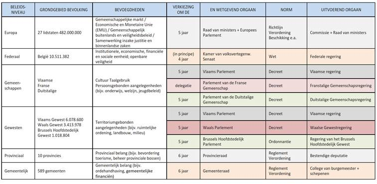
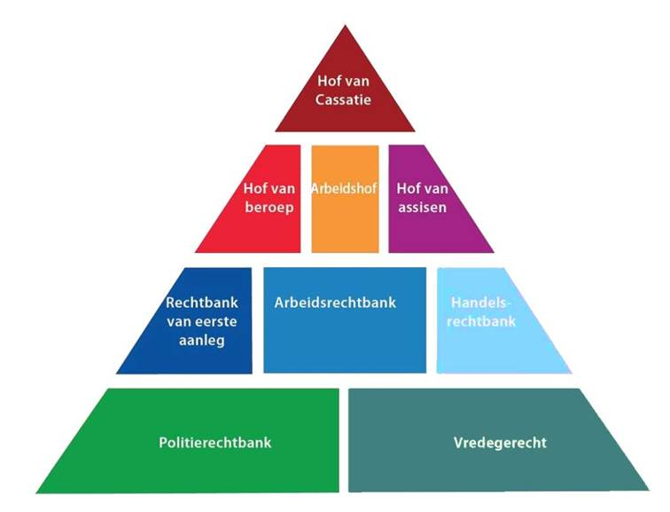

#Inleiding#

**BISTEL-zaak?**

BISTEL was een elektronisch informatiesysteem dat toegang gaf tot databanken van de federale overheid. Een ex-medewerker verschafte zichzelf en een vriend toegang dmv het wachtwoord van de premier en een kabinetsmedewerkster.

---

####Welke juridische problemen waren er en waarom?

Geen wettelijk kader tegen hacking. Informatica was relatief nieuw.

---

####Hoe zijn de juridische problemen opgelost?

De wet inzake informaticacriminaliteit werd ingevoerd.

---

####Hoe kan computercriminaliteit algemeen omschreven en ingedeeld worden?

**Theoretische indeling**

- A-specifieke ICT criminaliteit
    - Strafbare gedragingen waarbij het ICT-systeem als middel wordt aangewend.
    - ICT is hier **niet een noodzakelijk onderdeel** om het misdrijf te plegen.
- Specifieke ICT criminaliteit
    - Strafbare gedragingen die het ICT systeem of de opgeslagen data of programmatuur als ***voorwerp*** hebben.
	- De ICT is hier **een noodzakelijk onderdeel** van het misdrijf

Deze indeling is puur theoretisch en moeilijk toe te passen in de praktijk

**Pragmatische indeling**

- De ICT is hier een noodzakelijk onderdeel van het misdrijf
- ICT als informatieverspreidingsmiddel
- ICT als direct communicatiemiddel
- ICT als middel voor plegen van klassieke misdrijven
- ICT of Cyber crime
- ICT als bewijs (‘getuige’)

Geen strikte indeling, er is altijd sprake van overlapping

---

####Waarom / waardoor is computercriminaliteit een probleem voor justitie en politie?

- Voor het oplossen van misdrijven (o.m. identificatie van de daders) moet bewijsmateriaal opgespoord worden
in een ***massa*** aan gegevens, die nadien ***zichtbaar en leesbaar*** gemaakt moeten worden.

- Nieuwe criminaliteitsvormen moeten effectief bestreden worden, met respect voor de rechten van de **verdediging** en het **slachtoffer**

---

####Hoe kan dit probleem o.m. opgelost worden?

- Een aangepast wettelijk kader met aangepaste wettelijke procedures
- Door het voorhanden zijn van de nodige middelen zoals personeel en onderzoekstools
- Kennis en knowhow bij de onderzoekers.

---

#Beginselen van recht#

####Wat is de scheiding der machten?

Om machtsmisbruik te fnuiken wordt in een rechtsstaat het staatsgezag uitgeoefend door verschillende staatsmachten, die elkaar wederzijds controleren en beperken. Het beginsel van de scheiding der machten is een hoeksteen van het Belgisch grondwettelijk stelsel. Een persoom kan maar in 1 van deze machten werken.

---

####Wie oefent in België die machten uit?

**Wetgevende macht**: koning + parlement

**Uitvoerende macht**: koning + regering (ministers) + ambtenaren

**Rechterlijke macht**: zittende magistratuur (rechters) + staande magistratuur (parket / openbaar ministerie)

---

####Wat is het belang van de scheiding der machten?

Om de democratie te beschermen tegen machtsmisbruik

---

####Hoe is België gestructureerd?

Federale staat, gewesten, gemeenschappen

Gemeenschappen en Gewesten zijn elkaars gelijke (even veel macht) maar hebben verschillende bevoegdheden.

**3 Gemeenschappen**

- Vlaamse Gemeenschap
- Franse Gemeenschap
- Duitstalige Gemeenschap

**3 Gewesten**

- Vlaams Gewest
- Waals Gewest
- Brussels Hoofdstedelijk Gewest

**4 Taalgebieden** (niet belangrijk) 

- Nederlandse taalgebied
- Franse taalgebied
- Duitse taalgebied
- Tweetalig gebied (Brussel)

---

####Met welke beleidsniveaus?

Zie: Vlaamse Gemeenschap en Vlaams gewest is gefuseerd, er zijn in vlaanderen geen aparte diensten, parlementen, regeringen, besturen, ... 
Bij Waalse gewest / Franse gemeenschap is dit wel

---
#Justitie in België#

####Geef een overzicht van de gerechtelijke indeling van België wat betreft de Hoven en Rechtbanken.

---

####Geef summier aan welke bevoegdheden de resp. Hoven en Rechtbanken hebben.

**Vredegerecht**
Burgerrecht tot 2500 euro, huurproblemen, burentwisten, onteigening
**Politierechtbank**
Strafrecht overtredingen & wanbedrijven met verzachtende omstandigheden, misdrijven in bijzondere wetten, *verkeersmisdrijven*
**Rechtbank van eerste aanleg**
Bevat 3 onderdelen:

1. **Burgerlijke rechtbank**
Burgerlijk recht hoger dan 2500 euro
Burgerlijke zaken: koopovereemkomsten inzake onroerende goederen, huurovereenkomsten van roerende goederen, bouwzaken...

2. **Familie rechtbank** & **Jeugdrechtbank**
Familie: geschillen in familieleven, echtscheidingen
Jeugdrechtbank: bescherming van kinderen, strafbare feiten door minderjarigen, geen straffen, maar maatregelen
(Een minderjarige heeft strafrechtelijke onverantwoordelijkheid)

3. **Correctionele rechtbank**
Strafrecht van alle wanbedrijven zoals fraude, oplichting, onopzettelijke doodslag, inbraak, diefstal met geweld
Zij is ook beroepsinstantie voor de politierechtbank

**Arbeidsrechtbank**
Sociale zekerheid, arbeidsgeschillen en arbeidsongevallen

**Rechtbank van Koophandel (of Handelsrechtbank)**
Geschillen tussen handelaars, personen die een economisch doel nastreven

**Hof van Beroep**
In beroep gaan (vanuit Rechtbank van eerste aanleg en Handelsrechtbank)

**Arbeidshof**
In beroep gaan (vanuit Arbeidsrechtbank)

**Hof van Assisen**
Beschuldigden van misdaad
Heeft een volksjury

**Hof van Cassatie**
Spreekt zich uit over het recht, procedures, niet over een specifieke zaak

---

####Wat is het "Openbaar Ministerie"?

Het Openbaar Ministerie vertegenwoordigt de samenleving in de rechtbank. De magistraten die verbonden zijn aan een parket of aan een auditoraat vormen samen het Openbaar Ministerie. 
Zij vervolgen inbreuken op de strafwet. De voornaamste taken van het Openbaar Ministerie zijn:

- Het opsporen en vervolgen van misdrijven. De magistraten van het Openbaar Ministerie leiden het strafonderzoek, sporen de daders op en vorderen in de rechtbank een straf tegen de verdachten.
- Advies verlenen in burgerlijke zaken. Ze helpen de rechters met advies over de toepassing van de wet op het voorgelegde geschil.

---

####Hoe is het georganiseerd in België, met welke bevoegdheden?

- **Parket** *(van de procureur des Konings).*
De procureur des Konings en zijn eerste substituten en substituten treden op als Openbaar Ministerie bij de rechtbank van eerste aanleg, de politierechtbank en de rechtbank van koophandel. 

- **Arbeidsauditoraat**
De arbeidsrechtbank heeft zijn eigen 'openbaar ministerie': het arbeidsauditoraat.

- **Parket-Generaal**
Bestaat uit procureur-generaal en eerste advocaat-generaal, advocaten-generaal en substituten-procureur-generaal. Treedt op als OM bij **Hof van Beroep.**

- **Auditoraat-Generaal**
Bestaat uit procureur-generaal en eerste advocaat-generaal, advocaten-generaal en substituten-generaal. Treedt op als OM bij **Arbeidshof**.

- **Parket-Generaal bij het Hof van Cassatie**
Bestaat uit procureur-generaal, parket-generaal, eerste advocaat-generaal en advocaten-generaal. Treedt op als OM bij **Hof van Cassatie**.

- **Federaal parket**
Bestaat uit federale procureur en federale magistraten. Treedt op als OM bij zaken die bevoegdheid van plaatselijke parketten overstijgen, ze hebben bevoegdheid over het hele Belgisch grondgebied.
bv. Georganiseerde misdaad en terrorisme

- **College van Procureurs-Generaal**
Bestaat uit procureurs-generalen bij de hoven van beroep. Waakt over de OM en adviseert minister van Justitie over zaken hieromtrent.

- **Raad van Procureurs des Konings** 
Adviseren het College over alles omtrent het OM.

--- 

#Strafrecht#

####Welke zijn de grondkenmerken van strafrechtelijke straffen?

- **Wettelijk**
Ze hebben een wettelijk karakter; ze berusten steeds op een wettelijke basis(=legalisteitsbeginsel). Enkel een wet kan een straf invoeren.
- **Rechterlijk**
Enkel een rechter kan een strafrechtelijke straf opleggen. Er is dus een verschil met administratieve straffen(door een overheid opgelegd) en tuchtstraffen (door een tuchtorgaan opgelegd).
- **Persoonlijk**
Ze kunnen slecht opgelegd worden aan de die persoon die het misdrijf heeft gepleegd, niet aan een derde.
- **Individueel**
Ze kunnen niet collectief worden opgelegd. Indien er meerdere deelnemers bij eenzelfde misdrijf betrokken zijn, moeten de straffen individueel uitgesproeken worden(voor iedere persoon apart).

---

####Wat zijn hoofdstraffen, bijkomende straffen en vervangende straffen?

- **Hoofdstraffen** zijn straffen die afzonderlijk kunnen worden opgelegd
- **Bijkomende** straffen kunnen enkel MET een hoofdstraf worden uitgesproken
- **Vervangende** straffen zijn straffen die in de plaats komen van andere straf(bv boete vervangende gevangenisstraf)

---

####Wat zijn de constitutieve bestanddelen van een misdrijf?

**Materieel element**
De uiterlijke verschijningsvorm van het misdrijf (de handeling of verzuim) waardoor de grondwet wordt overtreden.
Het kan ofwel een 'positieve' handeling zijn, die door de wet verboden is, of ook een strafbaar laten: het niet- doen van hetgeen door de wet is voorgeschreven.

**Moreel element** of zedelijk bestanddeel
Als een gedraging overeenkomt met een materieel element van een wet is dit nog niet een strafbaar feit.
Er moet altijd minstens een schuld zijn in hoofde van de persoon. (Hij moest het willens en wetens doen)
= Is het Schuld of Opzet?

**Wederrechtelijkheid**
(niet altijd van toepassing)
Duidt op aanwezigheid van rechtvaardigheidsgronden, het misdrijf is niet voltrokken door de loutere aanwezigheid van het in de wet bepaalde materieel en moreel bestanddeel.
Vereist is bovendien dat de gedraging niet gerechtvaardigd is.

bv: Een tandarts die een kies trekt, maakt zich schuldig aan 'mishandeling', maar de toestemming van de patiënt, heft de wederrechtelijkheid van de 'mishandeling' op.

---

####Welke soorten opzet bestaan er in strafrechtelijke context? Bespreek ze summier.
Er zijn verschillende schakeringen om opzet te herkennen:

- **Algemeen opzet**
Een daad die strafbaar is gesteld wetend en willend stellen.
- **Bijzonder opzet**
Bedrieglijk, kwaadwillig, oogmerk tot schaden.
bv: Diefstal bevat bijzonder opzet: "bedrieglijk wegnemen"
- **Zeer/gans bijzonder opzet**
Bijzonder doel, bv. Oogmerk te doden
- **Voorbedachtheid**
Met voorbedachten rade. Dader had plannen gemaakt.

.

- **Bepaald opzet**
De dader heeft de handeling/verzuim als het gevolg gewild.
- **Onbepaalde opzet**
Hij wil de daad & gevolgen, maar deze zijn niet duidelijk. 
bv: Schieten in het wilde en iemand verwonden)
- **Gebeurlijk opzet**
De gevolgen zijn bekend, maar de dader had deze niet tot doel. 
bv: Slagen en verwondingen die de dood voor gevolg hebben.

---

####Wat is volgens het Strafwetboek:

- **Een misdaad?**
Een strafbaar feit waarop **criminele straffen** zijn gesteld **opzet is altijd vereist** zelfs als het opzet niet uitdrukkelijk is vermeld. **Poging tot misdaad is steeds strafbaar**.
= Vrijheidsstraffen van >5j en boetes >=26 euro

- **Een wanbedrijf?**
Feiten waarop **correctionele straffen** zijn gesteld. **Opzet is altijd vereist tenzij het tegenovergestelde is vermeld**. **Poging tot wanbedrijven is slechts strafbaar in de gevallen die door wet worden bepaald.**
= Vrijheidsstraffen (in principe) <=5j en boetes >=26 euro

- **Een overtreding?**
Feiten waarop politiestraffen zijn gesteld. **Schuld is in het algemeen voldoende**.
= Vrijheidsstraffen 1-7 dagen en boetes tot 25 euro

---

####Hoe worden de misdrijven ingedeeld volgens al dan niet vereiste van een klacht? Geef een toelichting.

- **Klachtmisdrijven**
Kunnen enkel vervolgd worden na een klacht van het slachtoffer

- **Gewone misdrijven**
Procureur des konings kan vervolging instellen

---

####Hoe worden opzet en schuld in de wetteksten (o.m. Strafwetboek) aangeduid?

- **Opzet**
*met kennis, met inzicht, kwaadwillig, met voorbedachte rade*

- **Schuld**
*uit nalatigheid, door verzuim, onachtzaamheid, gebrek aan voorzorg*

---

####Wat is poging tot misdaad of wanbedrijf?

Wanneer het voornemen om een misdaad of een wanbedrijf te plegen zich heeft geopenbaard door **uitwendige daden** die een begin van uitvoering van die misdaad of van dat wanbedrijf uitmaken, en die alleen wegens omstandigheden **onafhankelijk van de wil van de dader, werden gestaakt** of hun uitvoering hebben gemist.

---

####Wat zijn, in strafrechtelijke context, wettelijke verzwarende omstandigheden?
Zijn in de wet vermeld, voor bijkomende elementen, het misdrijf wordt verzwaard erdoor en heeft een verhoogde straf tot gevolg.

Voorbeelden van verzwarende omstandigheden door de wet bepaald:

- Diefstal: inklimming, braak, gebruik van valse sleutels
- Opzettelijke slagen en verwondingen: ziekte, werkongeschiktheid, overlijden van het slachtoffer
- Zedenfeiten: de leeftijd van het slachtoffer, de hoedanigheid van de dader

---

#Strafprocesrecht

####Geef een schematisch overzicht van het verloop van het strafproces. Verduidelijk telkens summier de processtappen.

**1. Klacht, aangifte door particulieren, ambtelijke aangife**
**2. Vooronderzoek**
Verdachte identificeren, kijken of er genoeg bezwaren/bewijzen zijn..). 
Kan de vorm aannemen van een opsporingsonderzoek of een gerechtelijk onderzoek

Het is in principe geheim (er zijn uitzonderingen), niet-tegensprekelijk (nog geen recht op tegenspraak) en schriftelijk (proces-verbaal).

**3. Onderzoek ten gronde**
Uitspraak over de grond van de zaak, nagaan of feiten bewezen zijn en juiste straf wordt gezocht. 
Gevoerd voor de vonnisgerechten, in aanwezigheid van beklaagde, die nu het openbare ministerie kan tegenspreken (recht op tegenspraak)

---

####Wat zijn tijdens een strafproces het opsporingsonderzoek en het gerechtelijk onderzoek? Wat zijn de verschillen?

**Opsporingsonderzoek**

- Onder leiding van procureur
- Zonder dat er dwangmaatregelen (zoals huiszoeking)
Meer dan 90% van de zaken wordt op deze manier afgehandeld

**Gerechtelijk onderzoek**

- Is voor de zwaarste misdrijven.
- Onder leiding van de onderzoeksrechter op vordering van de procureur.
- Dwangmaatregelen kunnen gebruikt worden, 
- Verdachte en slachtoffer kunnen onderzoek meesturen (sinds de Wet Franchimont).
- Verloopt onder controle van de kamer van inbeschuldigingstelling.

---

####Welke voorwerpen kunnen tijdens een strafrechtelijk vooronderzoek worden in beslag genomen?

- Het voorwerp van het misdrijf (bv. het vervalste stuk)
- Alles wat gediend heeft (of had moeten dienen) voor het plegen van het misdrijf (bv. Een computer, een wapen)
- Zaken die uit het misdrijf voorkomen (bv. vals geld)
- Primaire en secundaire vermogensvoordelen

---

####Artikel 39 bis Wetboek van Strafvordering voorziet in een aantal juridisch-procedurele handelingen ten aanzien van "data". Geef een opsomming ervan en geef een toelichting.

**Kopiëren van bestanden**
Er bestaat dus nu de mogelijkheid om enkel een kopie van de bestanden te maken op dragers van de Overheid (art. 39bis § 2 WSV). 
Enkel in geval van dringendheid of om technische redenen kunnen dragers worden gebruikt die ter beschikking staan van personen die gerechtigd zijn het informaticasysteem te gebruiken.
**Verhinderen van de toegang tot gegevens**
Indien het kopiëren van data niet mogelijk blijkt omwille van technische redenen of wegens de omvang van de te kopiëren gegevens, dan wendt de procureur des Konings of de onderzoeksrechter passende technische middelen aan om de toegang tot de gegevens te verhinderen en hun integriteit te waarborgen.
**Vernietiging van gegevens**
Indien de Procureur des Konings van oordeel is dat de gegevens die worden aangetroffen, strijdig zijn met de openbare orde of de goede zeden, dan kan hij de vernietiging bevelen van deze gegevens.
**Bewaring door aanwending van gepaste technische middelen**
Op de procureur des Konings of de onderzoeksrechter rust de verplichting om de integriteit en de vertrouwelijkheid van gegevens te waarborgen, door de aanwending van de passende technische middelen. Verder dienen “gepaste technische middelen” te worden aangewend voor den bewaring ter griffie van gegevens of van gegevens die samen met hun drager in beslag zijn genomen.

---

####Een slachtoffer van een grote en ernstige fraude, gepleegd via internet, legt wegens die feiten klacht neer bij de politie.  Welke handelingen stelt de politie? En welke handelingen kan de politie, in geval van uiterst dringende noodzakelijkheid, eventueel stellen?

1. De procureur des Konings heeft de bevoegdheid de identificatiegegevens op te vorderen met betrekking tot:
    - telecommunicatiediensten waarop een bepaald persoon geabonneerd is
    - die door een bepaald persoon gebruikt worden.

2. Er kan opgevraagd worden wie de abonnee of gewoonlijke gebruiker is van een elektronische communicatiedienst of van een elektronisch communicatiemiddel. Er kan m.a.w. nagegaan worden wie daaraan is gekoppeld.
    - De identificatie van een telefoonnummer.
    - De identificatie van een IP-adres, gebruikt op een bepaald tijdstip

3. Er kan worden nagegaan welke elektronische communicatiedienst of welk elektronisch communicatiemiddel gekoppeld is aan een bepaalde persoon.
    - De vraag om te weten over welke telefoonnummers een bepaald persoon beschikt.
    - De vraag om te weten over welke e-mailadressen een bepaald persoon beschikt.

Het is dus mogelijk om:

- e-mailadressen
- gebruikersprofielen van:
     + gebruikersprofielen van sociale netwerken
     + zoekertjes- en veilingsites
- gebruikte aliassen of pseudo's

... te identificeren, te achterhalen.

In gevallen van uiterst dringende noodzakelijkheid kan dit ook door een officier van de gerechtelijke politie worden uitgeoefend, na voorafgaande mondelinge toestemming van de procureur des Konings. De officier van gerechtelijke politie moet binnen de 24.00 uur de gemotiveerde en schriftelijke beslissing alsook de ontvangen gegevens meedelen aan de procureur des Konings. 

De opgelegde medewerkingsplicht geldt zowel ten aanzien van telecommunicatieoperatoren als van de zogenaamde dienstenverstrekkers. Is er sprake van weigering van medewerking, dan kunnen ze strafrechtelijk worden gestraft.

---

###Hoe kan een profiel op/van een sociale netwerksite in een strafrechtelijk vooronderzoek "geïdentificeerd" worden? Wie kan dit vragen? Op grond van welke wettelijke basis?

Volgens **Art. 46 bis WSV** heeft de procureur des Konings (& OR), bij het opsporen van misdaden en wanbedrijven, de bevoegdheid de identificatiegegevens op te vorderen met betrekking tot:

- telecommunicatiediensten waarop een bepaald persoon geabonneerd is 
- die door een bepaald persoon gebruikt worden.

Er kan worden nagegaan welke elektronische communicatiedienst of welk elektronisch communicatiemiddel gekoppeld is aan een bepaalde persoon.
Ze vragen de IP-adressen op bij de netwerksite (met tijdstippen) (vaak registratie), en dan de gegevens van het abonnee dat het IP gebruikte op dat ogenblik bij de ISP/IAP.

---

####Hoe kan in een strafrechtelijk vooronderzoek een IP-adres "geïdentificeerd" worden? Wie kan dit vragen? Op grond van welke wettelijke basis?

Hoe? Het IP adres kan geïdentificeerd worden bij de gegevens van de ISP.
Wie? De PK of onderzoeksrechter of OGP.
Wettelijke basis?  artikel 46bis.

---

####In  een strafrechtelijk vooronderzoek wordt een Internet Service Provider (ISP) door een magistraat gevraagd (gevorderd) een IP-adres te "identificeren".  Welke verplichtingen heeft de ISP ten aanzien van die vordering?

Hij dient zijn abonnementsgegevens van de gebruiker vrij te geven, anders riskeert hij sancties. 
En dient geheimhouding (van die gegevens) te verzekeren wegens Art 458 SWB aka Beroepsgeheim.

---

####In een e-mailbericht wordt een ernstige bedreiging (= misdrijf) geuit aan de ontvanger van het bericht. Hoe en waar kan de ontvanger van het bericht  (= slachtoffer) klacht indienen. Hoe verloopt het strafrechtelijk vooronderzoek?

Bij de politie.

**Identificatiestappen**
1. Verkeer- en registratiegegevens van het e-mailadres (zender) opvragen (art 88bis)
2. Whois IP-adres
3. Klantengegevens opvragen bij de IAP (art 46bis)

---

####Is het in een strafrechtelijk vooronderzoek mogelijk om de oorsprong of de bestemming van telecommunicatie te achterhalen?  In voorkomend geval op welke wettelijk basis en door welke magistraat?

Ja de Onderzoeksrechter kan dit opvragen art dankzij 88bis.

---

####Kan in  een strafrechtelijk vooronderzoek zonder meer aan een Internet Service Provider gevraagd worden over welk(e) e-mailadres(sen) een verdachte persoon beschikt? Of is daarvoor altijd een vordering van een magistraat nodig? In voorkomend geval, van  welke magistraat? Of zijn er uitzonderingen? Geef summier de wettelijke basis op.

Ja, 46bis, procureur of or, of in dringende geval politie.

---

####Op basis van  welke bepalingen kunnen de identificatie en het opsporen en lokaliseren van elektronische communicatie tijdens een strafrechtelijk vooronderzoek worden uitgevoerd?**

46bis, identificatie van elektronische diensten / middelen. 
Opsporen en lokaliseren = 88bis.

---

####Op bevel van een onderzoeksrechter wordt er een zoeking uitgevoerd in een informaticasysteem van de hoofdzetel van het  bedrijf AZERTY in Brugge.  Tijdens die zoeking wordt vastgesteld dat er cruciale gegevens (= bewijs voor het strafrechtelijk vooronderzoek) aanwezig zijn op een informaticasysteem van de productieafdeling van het bedrijf AZERTY te Oostende.  Welke onderzoekshandelingen kan de onderzoeksrechter (laten) stellen? Onder welke voorwaarden?

De onderzoeksrechter kan de uitbreiding van een zoeking in een informaticasysteem of een gedeelte ervan bevelen naar een informaticasysteem of een deer daarvan dat zich op een andere plaats bevindt onder de volgende 2 voorwaarden:

- De maatregel moet noodzakelijk zijn voor de waarheidsvinding ten aanzien van het onderzochte misdrijf
- Bovendien moet:
    - Hetzij een risico bestaan dat de bewijsgaring in het gedrang komt
    - Hetzij het nemen van andere maatregelen disproportioneel zijn

---

####Op bevel van een onderzoeksrechter wordt er een zoeking uitgevoerd in een informaticasysteem van de hoofdzetel van het  bedrijf AZERTY in Brugge.  Tijdens die zoeking wordt vastgesteld dat er cruciale gegevens (= bewijs voor het strafrechtelijk vooronderzoek) aanwezig zijn op een informaticasysteem van de productieafdeling van  het bedrijf AZERTY te Sluis (Nederland).  Welke onderzoekshandelingen kan de onderzoeksrechter (laten) stellen? Onder welke voorwaarden?

Art. 88ter, §3, 2e lid WSV bepaalt 
>gegevens die (per toeval of onopzettelijk) uit het buitenland werden bekomen, enkel worden gekopieerd, en dit om de teloorgang van het bewijsmateriaal te verhinderen. De toegang tot deze buitenlandse gegevens kan, in tegenstelling tot bij het gewone databeslag, niet worden verhinderd; evenmin kunnen ze worden geblokkeerd of gewist.

_Enkel kopieren, niet wissen of blokkeren, vreemde staat (Nederland) op de hoogte stellen. (88ter)_

---

####Tijdens een strafrechtelijk vooronderzoek stuiten de onderzoekers op informaticatechnische moeilijkheden, die hen beletten om een informaticasysteem te benaderen en/of te  onderzoeken. Kan de beheerder van het informaticasysteem (= geen verdachte) verplicht worden om toegang te verlenen tot het informaticasysteem.  In voorkomend geval, op grond van welke wettelijk basis.

Het art. 88quater WSV voorziet in de mogelijkheid om personen die het te onderzoeken informaticasysteem kennen of over een bijzondere expertise beschikken inzake bepaalde aspecten daarvan (bijvoorbeeld inzake beveiliging of cryptografie) te verplichten bijstand te verlenen aan de gerechtelijke overheden door mee te werken aan de bewijsgaring.
Men kan twee categorieën 'deskundigen' onderscheiden, nl.

- diegenen met een bijzondere kennis van het informaticasysteem in kwestie
- diegenen die om hun technische kennis gevraagd worden om het systeem te bedienen maar die geen specifieke band hebben met het informaticasysteem in kwestie.

De verplichting om mee te werken kan niet opgelegd worden aan de verdachte zelf en diens naaste familieleden. Anderen riskeren zware bestraffen indien ze de medewerking weigeren.

---

####Tijdens een strafrechtelijk vooronderzoek worden in bestanden op een informaticasysteem gegevens aangetroffen die duidelijk een bewijs vormen in het onderzoek.  De bestanden kunnen evenwel niet gekopieerd worden. Welke juridisch-procedurele handelingen kunnen er gesteld worden?

De toegang tot de gegevens blokkeren en zorgen dat ze niet gewijzigd kunnen worden (= feitelijk een elektronische verzegeling). 39bis.

---

####Tijdens een strafrechtelijk vooronderzoek worden in één directory op een server van een bedrijf bestanden aangetroffen die een onweerlegbaar bewijs vormen in het strafonderzoek.  Welke juridisch-procedurele handelingen kunnen er gesteld worden?  Op grond van welke wettelijke basis?

Kopiëren van de directory / specifieke gegevens 39bis

---

####Tijdens een strafrechtelijk vooronderzoek worden op 5 USB-sticks, voor het onderzoek nuttige, gegevens aangetroffen.   Hoe worden die materiële gegevensdragers juridisch-procedureel behandeld? Op grond van welke wettelijke basis?

Ze worden in beslag genomen volgends de regels uit artikel 35.
m.a.w. volgens de traditionele procedures. Er is geen extra bevel nodig om de gegevens op fysieke dragers te "exploiteren".

---

####Tijdens een strafrechtelijk vooronderzoek worden op een server van een bedrijf in een 1000-tal bestanden aangetroffen die duidelijk kinderpornografie bevatten. Welke juridisch-procedurele handelingen kunnen er gesteld worden?  Op grond van welke wettelijke basis?

Gegevens worden gekopieerd & verwijdert (ipv blokkering), artikel 39bis

tenzij het voorwerp zijn van of voortgekomen zijn uit het misdrijf

---

####Via een veiling- of zoekertjessite is een misdrijf gepleegd. Hoe kan in een strafrechtelijk achterhaald worden van waaruit het misdrijf werd gepleegd? Op grond van welke wettelijke basis?

46bis: elektronische communicatiedienst geeft IP vrij, via ISP wordt plaats van gebruik van IP op dat tijdstip gevraagd.

---

#Internationale computercriminaliteit#

####Waarop is internationale samenwerking in strafzaken gebaseerd?

Gebaseerd op overeenkomsten tussen twee of meerdere landen om de gerechtelijke en politeriale samenwerking te bevorderen; specifiek:

- Op strafrechtelijk gebied onderling in de meest ruime zin bijstand verlenen
- Verzoeken tot rechtshulp door de gerechtelijke overheden tot elkaar gericht
- In bepaalde gevallen ambtenaren afvaardigen om het opsporingsonderzoek bij te wonen.

---

####Wat is internationale gerechtelijke samenwerking?

Samenwerking bij rechtszaken, uitlevering, overdracht van strafvervolging, strafexecutie.
(= Overeenkomst)

---

####Wat zijn de doelstellingen van het Cybercrimeverdrag (summier)?

Gemeenschappelijk strafrechtelijk beleid gericht op bescherming van strafbare feiten verbonden aan elektronische netwerken. 
Passende wetgeving (zoals grensoverschrijdende opsporingsbevoegdheden) die internationale samenwerking versterken.
Constitutieve elementen harmoniseren inzake misdrijven van het nationale materiële strafrecht.

---

####Wat is de rol van resp. Europol en Interpol?

**Europol**
De Europese politiedienst die moet de slagvaardigheid van en de **samenwerking tussen de bevoegde diensten van de lidstaten verbeteren** zodat de internationale georganiseerde misdaad doeltreffend kan worden bestreden.

- Europol **heeft niet dezelfde uitvoerende bevoegdheden** als de politiediensten van de lidstaten en kan dus geen personen aanhouden of huiszoekingen doen
- Europol moet de **uitwisseling van informatie vergemakkelijken**, die informatie analyseren en operaties tussen de lidstaten coördineren

**Interpol**
Internationale organisatie die zich bezighoudt met het **ondersteunen van politieorganisaties bij het voorkomen en bestrijden van criminaliteit**

- Interpol is de organisatie die zorgt voor de uitvoering van internationale opsporing van personen met het oog op hun aanhouding, uitlevering of andere maatregelen
- Interpol moet faciliteren van informatie-uitwisseling tussen de politiediensten en de aangesloten landen
- Assisteren aangesloten politiediensten bij het analyseren van informatie

---

#Politiediensten in belgië#

####Hoe zijn de politiediensten in België gestructureerd. Licht kort toe.

**Lokale politie**

- Verantwoordelijk voor de basispolitiezorg in één van de 196 politiezones

**Federale politie**

- Streeft naar het opsporen van criminele fenomenen
- Uitvoeren van gerechtelijke of opsporingsonderzoeken
- Aanpakken van criminele organisaties

Tussen beide niveaus bestaat er geen onderlinge hiërarchie. Ze hebben elk hun specifieke taken  en zijn zodanig op elkaar afgestemd dat ze elkaar steeds kunnen bijstaan.
Daarnaast richten talrijke bijzondere wetten specifieke opsporingsdiensten in

---

####Welke politiediensten zijn gespecialiseerd in het onderzoek van computers, informaticasystemen en telecommunicatiesysteem? Licht hun werking toe.

**FCCU:  Federal Computer Crime Unit**

- Op nationaal niveau binnen de directie van strijd tegen financiële criminaliteit
- heeft als doel de burgers te beschermen tegen alle vormen van traditionele en nieuwe criminaliteit.
- De bestrijding van andere criminele fenomenen ondersteunen met gespecialiseerde recherche in ICT-omgeving
- Ook pedofilie op het internet, internetfraude en telecomfraude behoren tot de competenties

**RCCU: Regionale Computer Crime Unit**

- Binnen elke gerechtelijke directie in de arrondissementen onder leiding van de gerechtelijke directeurs
- Biedt minimale garantie op kwalitatief goed forensisch ICT-onderzoek van PC-apparatuur, andere gegevensdragers en kleine netwerken
- Onderzoeken sporen van internetcriminaliteit en identificeren de daders

---

#De Wet inzake Informaticacriminaliteit#

####Welke misdrijven en welke procedures werden resp. in het Strafwetboek en het Wetboek van Strafvordering door de 'Wet inzake Informaticacriminaliteit - 28/11/2000' ingevoerd?  Geef telkens een toelichting.

- **Strafwetboek**
    - **Valsheid in informatica**
	Betrekking op het wijzigen, wissen of veranderen van de aanwending van gegevens in een informaticasysteem, zodat de juridische draagwijdte van deze gegevens verandert
    - **Informaticabedrog**
    Bedrieglijk voordeel voor zichzelf of voor een ander door middel van gegevensmanipulatie
    - **Datamanipulatie**
    Vernieling of beschadiging, met het oogmerk om te schaden, van gegevens
    - **Ongeoorloofde toegang (hacking)**
    Het wetens toegang bekomen tot een informaticasysteem of een deel ervan waartoe men niet gerechtigd is
- **Wetboek van strafvordering**
    - **Databeslag**
   In beslag nemen van het materiaal die nodig was om het misdrijf te plegen
    - **Netwerkzoeking**
   Onderzoeken van de systemen en het netwerkverkeer

---

####Wat is 'valsheid in informatica' (artikel 210 bis Strafwetboek - 'Wet inzake Informaticacriminaliteit - 28/11/2000)?

De wetgever beoogde hiermee voornamelijk een einde te stellen aan de discussie of de klassieke bepalingen van de valsheid in geschriften toegepast konden worden op gegevens in een informaticacontext en zo ja onder welke voorwaarden. Zowel in rechtspraak als in rechtsleer werd er reeds geruime tijd gedebatteerd over de mogelijkheid hiervan en over de conformiteit ervan aan de constitutieve bestanddelen van de klassieke valsheid.

Indien er dus gegevens gewijzigd worden op een manier die de eventuele juridische draagwijdte ervan verandert, dan is er sprake van een valsheid in informatica.
Het misdrijf vereist een bijzonder opzet, vermits het gewijzigde art. 193 van het Strafwetboek bepaalt dat valsheid in geschriften, in informatica of in telegrammen, met bedrieglijk opzet of met het oogmerk om te schaden, gestraft wordt overeenkomstig de daarop volgende artikelen.

**Voorbeelden**

- **Invoer van gegevens**
    - het aanmaken van een nieuwe toegangscode (o.m. paswoord) in een IT-systeem waarmee een onbevoegde toegang tot dat systeem kan verkrijgen
    - het invoeren van een fictief e-mailbericht tussen persoon A en B
- **Wijzigen van gegevens**
    - de wijziging van een reëel verzonden e-mailbericht
    - de vervalsing van digitale contracten
    - de wijziging van gegevens in een elektronische overheidsdatabank
- **Wissen van gegevens**
    - het schrappen van gegevens uit een elektronische overheidsdatabank
    - het wissen van bepaalde onderdelen in een proces- verbaal of een verslag van de politie dat werd opgesteld op computer
- **Verandering van de mogelijke aanwending van gegevens**
    - het vervalsen en/of namaken van kredietkaarten of betaalkaarten

---

####Voor het misdrijf 'valsheid in informatica' (artikel 210 bis §1 Strafwetboek - 'Wet inzake Informaticacriminaliteit - 28/11/2000) wordt bijzonder opzet vereist. Wat moet daaronder worden verstaan?

Het moreel element van 'valsheid in informatica' is dat de handeling met **Bedriegelijk opzet** of met **het oogmerk om te schaden** is.

---

####Wat zijn resp. het materieel element en het moreel element van het misdrijf 'informaticabedrog' (artikel 504 quater Strafwetboek - 'Wet inzake Informaticacriminaliteit - 28/11/2000)?**

**Materieel**
Voor zichzelf of voor een ander een **onrechtmatig economisch voordeel beogen te verwerven** 
Door gegevens die worden opgeslagen, verwerkt of overgedragen door middel van een informaticasysteem, in een informaticasysteem in te voeren, te wijzigen, te wissen of met enig ander technologisch middel **de normale aanwending van gegevens in een informaticasysteem te veranderen**.

**Moreel**
Bedrieglijk opzet: het oogmerk om voor zichzelf of voor een ander een onrechtmatig economisch voordeel te verwerven

---

####Wat is (volgens artikel 550 bis Strafwetboek - 'Wet inzake Informaticacriminaliteit - 28/11/2000) het verschil tussen 'interne' en 'externe' hacking?

**Interne hacking**
Je toegangsniveau overschrijden, je had al rechtmatige toegang tot het systeem.
**Externe hacking**
Zonder enige gerechtigde toegang toch toegang verschaffen tot dat informaticasysteem

---

####Een vorm van skimming is het kopiëren van gegevens opgeslagen op een  betaal- of kredietkaart van een slachtoffer en tegelijkertijd ook de ingebrachte PIN-code registreren. Nadien worden de gekopieerde kaartgegevens weggeschreven op een zogenaamde 'blanco' kaart. Met die laatste kaart en de voorhanden PIN-code wordt dan de rekening van het slachtoffer gepluimd.

####Geef aan voor de volgende 3 stappen uit het verloop van dit misbruik; welk misdrijf wordt gepleegd; licht dit telkens summier toe met de wettelijke basis.

**het kopiëren van de, op de kaart van het slachtoffer, opgeslagen gegevens**

Ongeoorloofde toegang tot een informaticasysteem (Hacking) (Art 550bis SWB): hij weet dat hij niet gerechtigd is om toegang te krijgen tot de gegevens ven de kredietkaart, maar doet het toch

**het wegschrijven van de bekomen kaartgegevens op een 'blanco' kaart**

Valsheid in informatica (Art 210bis SWB): hij manipuleert de data zodat de juridische draagwijdte van deze gegevens verandert

**het afhalen van geld aan een bankautomaat met de 'blanco' kaart door het invoeren van de geregistreerde PIN-code**

Informaticabedrog (Art 504quarter SWB): hij haalt bankbiljetten uit een bankautomaat met het gebruik van een valse of vervalste bankkaart

---

#Wet elektronische communicatie#

####Hoe wordt e-mailverkeer beschermd door de wet van 13 juni 2005 op de elektronische communicatie?

In beginsel wordt e-mailverkeer beschermd door de wet van 13 juni 2005 op de elektronische communicatie.

Artikel 124 van die wet stelt verbodsbepalingen in, met name het verbod om:

- kennis te nemen van het bestaan van informatie van alle aard die via elektronische weg is verstuurd en die niet persoonlijk voor 'hem' bestemd is
- de personen te identificeren die bij de overzending van de informatie en de inhoud ervan betrokken zijn
- kennis te nemen van gegevens inzake elektronische communicatie en met betrekking tot een andere persoon
- informatie, identificatie of gegevens die met of zonder opzet werden verkregen, te wijzigen, te schrappen, kenbaar te maken, op te slaan of er enig gebruik van te maken.

⇒	Deze verbodsbepalingen dienen voornamelijk om de privacy van de betrokkenen en de integriteit van de gegevens te beschermen

---
#Kinderpornografie#

####Een persoon ontving ongewild een e-mail met 10 foto's in bijlage.  De foto's betreffen duidelijk kinderpornografie.  De ontvanger van het bericht doet van het feit aangifte bij de politie. Licht toe hoe het strafrechtelijk vooronderzoek verder kan verlopen; dit op grond van welke wettelijk basis en van welke technische gegevens.

- Verloop strafrechtelijk vooronderzoek
    - Bewijzen verzamelen
    - Daarvan kennis geven aan bevoegde overheid
    - Daders vatten
        - Eerst identificeren via mailadres en IP-adres (zie origineel antwoord van Tim)
    - Voorwerpen in beslag nemen
    - Verslag opmaken
- Op grond van welke wettelijke basis en technische gegevens
    - Leeftijdscriterium
    - Verspreiding van kinderpornografie
    - Bezit van kinderpornografie

Tim's:
De foto’s/e-mail worden gekopieerd & gewist (383bis) (39bis). Het IP-adres dat bij het e-mailadres hoort wordt opgevraagd (88bis). Op basis van het IP adres worden de identiteitsgegevens opgevraagd bij de ISP (46bis).

---

#Cyberpesten#

####Een persoon is slachtoffer van 'stalking' via het internet. Licht toe hoe een strafrechtelijk vooronderzoek kan gestart worden en hoe het verder kan verlopen; dit op grond  van welke wettelijk basis en van welke technische gegevens.

De persoon moet zelf een klacht indienen zodat het onderzoek gestart kan worden (442bis). 
Via artikel 46bis kan de identiteit van de stalker achterhaald worden. 
IP-adres via elektronisch communicatie middel opvragen. 
Vervolgens identiteitsgegevens aan ISP opvragen.

---

#Internetfraude#

####Wat is het verschil tussen het begrip 

####'bedrog gepleegd met behulp van informatica' of 'bedrog op het internet' 

Eén of meerdere misdrijven omvat waarvan er minstens één verband houdt met het gebruik van informatica als communicatiemiddel.
Elk type van fraudeschema dat gebruik maakt van e-mail, websites, instant messaging, gsm-toepassingen om potentiele slachtoffers frauduleuze verzoeken voor te leggen, frauduleuze transacties te verrichten of het bedrag van de fraude over te schrijven naar de betrokken financiële of andere instellingen.

---

####het begrip  'informaticabedrog' zoals voorzien in artikel 504 quater (Strafwetboek - 'Wet inzake Informaticacriminaliteit - 28/11/2000)?

Informaticabedrog slaat op het verwerven van een bedrieglijk vermogens-voordeel door het invoeren, wijzigen, wissen of veranderen van de aanwending van gegevens in een informaticasysteem.
