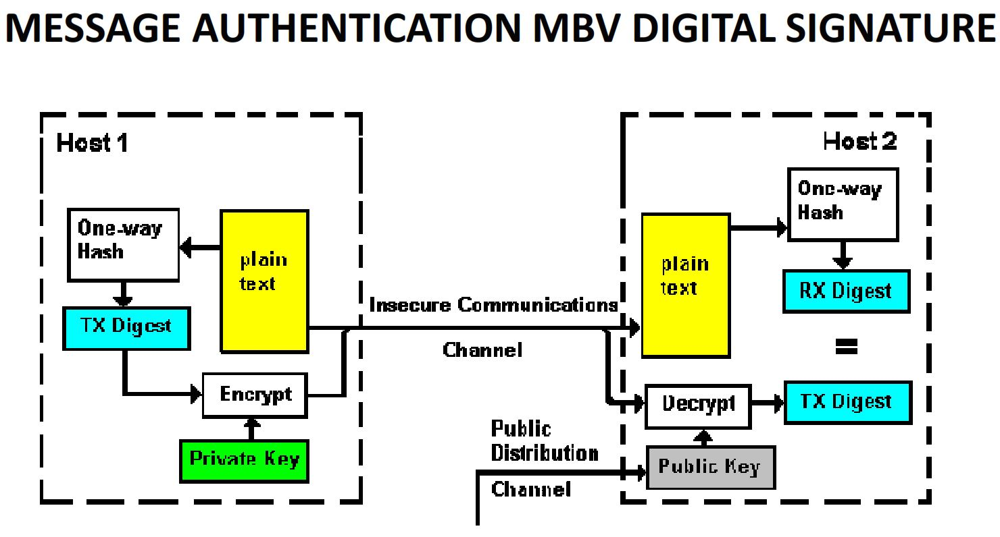

###Soorten bedreigingen
- Menselijke
– Fysische
– Omgeving

---

###Kwetsbaarheden
– In hardware
– In software
– In procedures
– In configuraties
– In fysische beveiliging

---

###CIA Triad
- Confidentiality: hoe ervoor zorgen dat data niet kan ingekeken of gebruikt worden door derden?
– Integrity: hoe ervoor zorgen dat data niet (onmerkbaar) gewijzigd wordt?
– Availability: hoe ervoor zorgen dat de toegang tot een computersysteem/data verzekerd is én blijft?

Andere beveiligingsaspecten:
- Authentication: hoe kunnen we zeker zijn dat iemand die toegang zoekt tot een computersysteem/data, wel degelijk is, wie hij/zij beweert te zijn?
- Access control; authorization: hoe ervoor zorgen dat de toegang tot een computersysteem of data beperkt wordt tot bevoegde personen en hoe bepalen welk soort toegang deze personen mogen hebben?
- Non-repudation: hoe ervoor zorgen dat communicatiepartners niet kunnen ontkennen dat ze aan de communicatie deelgenomen hebben?

---

###Methodes bij traditionele cryptografie
– Substitutiemethodes: elk(e) (groep) teken(s) wordt vervangen door een ander(e) (groep) teken(s)
– Transpositiemethodes: elk teken blijft behouden, maar krijgt een andere plaats in de tekenreeks

---

###Moderne cryptografie: private vs public

- Private key cryptografie
    - Maakt gebruik van één enkele sleutel om te coderen en te decoderen: _symmetrische cryptografie_
	- Korte sleutels
    - Voorbeelden: DES, 3DES, AES, in FEK
    - Belangrijkste nadeel: hoe veilig de private key distribueren?
- Public key cryptografie
    - Maakt gebruik van 2 verschillende sleutels: één om te coderen en één om te decoderen: _asymmetrische cryptografie_
    - Voorbeeld: RSA, in digitale handtekeningen
    - Belangrijkste nadeel: complexe algoritmen trager dan private key cryptografie

---

###Eigenschappen van hashfuncties
- Een willekeurig aantal inputbits wordt omgezet in een klein en vast aantal outputbits
– Het is “nagenoeg onmogelijk” om uit de outputbitreeks (message digest of digital fingerprint) de originele inputbitreeks samen te stellen
– Het is “nagenoeg onmogelijk” dat 2 verschillende inputbitreeksen resulteren in dezelfde outputbitreeksen (indien wel collision)

---

###Een X.509 certificaat bevat o.a.:
– Serienummer
– Identiteit v/d CA
– Identiteit v/d certificateneigenaar
– Geldigheidsperiode
– Public key v/d certificateneigenaar
– Digitale handtekening v/d CA (geëncrypteerd mbv private key v/d CA)

---

###Hoe controleert je browser een SSL certificaat
– Stemt het adres van de website overeen met het adres op het certificaat?
– Klopt de digitale handtekening in het certificaat? Hiervoor gebruikt je browser de public key van de CA die het certificaat verleend heeft. Die public key zit in het certificaat van die CA. Je browser bevat standaard een lijst van tientallen CA’s die vertrouwd worden.
– Is het certificaat nog geldig (expiracy date)?
– Werd het certificaat niet ingetrokken? Deze controle gebeurt door de zgn CRL (Certificate Revocation List) bij de CA op te vragen (deze controle kan door je browser overgeslagen worden)

---

###PKI-componenten: 
– Een Certification Authority (CA): genereren, uitgeven, intrekken van certificaten
– Een Registration Authority (RA):  registratie en vaststelling van de identiteit van de gebruikers
– Een Validation Authority (VA): nagaan of certificaat niet ingetrokken werd
– Directory: opslagplaats van certificaten en CRL’s (Certificate Revocation Lists = “zwarte lijsten”)
– Eindentiteiten: aanvragen van certificaten en genereren van private en public keys

---

###3 factor authentication
- gebaseerd op iets dat je hebt (digipass toestel / ID kaart)
- iets dat je weet (wachtwoord / PIN-code)
- iets dat je bent (biometrics)

---

###OTP wordt berekend op basis van
– Een secret op de bankkaart: om deze uit de bankkaart te halen dien je een PIN-code in te voeren
– De tijd (GMT) of een event counter (bv aantal keer dat je drukt op een knopje)
– Een encryptie-algoritme (3DES of AES)

---

###IPSec protocollen
– AH (Authentication Header): zorgt enkel voor authenticatie
– ESP (Encapsulating Security Payload): zorgt voor authenticatie én encryptie

---

###IPSec-modes
– Transport-mode:
    - enkel de payload (datagedeelte) v/e IP-pakket beveiligd
    - De IP-header (met o.a. source- en destination IP-adres) blijft onveranderd
    - wordt typisch gebruikt bij end-to-end communicatie (bv client – server)
– Tunnel-mode:
    - het volledige IP-pakket (header én payload) wordt beveiligd en in een nieuw IP-pakket gestopt
    - de buitenste IP-header bevat IP-adressen van begin- en eindpunten van de “tunnel” (typisch: routers of firewalls)
    - Geen enkele router in de tunnel kan de binnenste IP-header “zien”
    - Wordt typisch gebruikt voor communicatie tussen 2 routers of 2 firewalls die zich aan de grenzen van een LAN bevinden
	
---
	
###VPN Tunneling protocollen
– Het PPTP-protocol (Point-to-Point Tunneling Protocol): eenvoudig protocol dat gebruikmaakt van MPPE als encryptieprotocol (algortime = RC4) en GRE als tunnelingprotocol
– Het L2TP-protocol (Layer 2 Tunneling Protocol): werkt met IPsec (algoritme is vaak AES); minder snel, maar veiliger dan PPTP
– Het SSTP-protocol (Secure Socket Tunneling Protocol): een SSL VPN protocol; veiligste protocol; enkel beschikbaar in recente Windows-versies

---

###Soorten firewalls
- Appliance-based firewalls: deze firewalls bestaan uit dedicated hardware en worden ook wel “security appliances” genoemd (veel gebruikt in de bedrijfswereld). Een voorbeeld hiervan is de Cisco ASA-reeks (ASA = Adaptive Security Appliance). Andere bekende fabrikanten zijn Juniper, SonicWall (nu van Dell) en WatchGuard.
- Server-based firewalls: dit is software die boven op een netwerk operating system (NOS) draait (wordt niet zo veel meer gebruikt).
- Integrated firewalls: de meeste routers zijn tegenwoordig uitgerust met geïntegreerde firewall functionaliteit.
- Personal firewalls: deze firewalls vind je op host computers; meestal zitten ze ingebouwd in het OS, maar er bestaan ook “3th party firewalls”, die meestal als onderdeel van een security suite aangeboden worden (vb: Norton Internet Security)

---

###Firewall technieken
- Packet filtering: toegang toelaten of verbieden op basis van IP-adressen of poortnummers (ACLs)
– Application filtering: toegang toelaten of verbieden op basis van informatie in de applicatieheader: “deep packet inspection”
– Stateful packet filtering: filtering gebeurt niet enkel op basis van statische regels, maar ook op basis van de verbindingsstatus = connection state, bijgehouden in een connection state table in de firewall

---

###Een hardware firewall heeft vaak 3 interfaces
– WAN-interface (met publiek IP-adres)
– LAN-interface (meestal privé IP-adres)
– DMZ-interface (DMZ = DeMilitarized Zone = zone waar de publieke servers staan die bereikbaar moeten zijn vanaf het Internet

---

###IDS kan op verschillende niveaus toegepast worden:
– Op systeemniveau: IDS-sofware die op een server geïnstalleerd wordt
– Op applicatieniveau: IDS-software die voor een specifieke applicatie geschreven is
– Op netwerkniveau: sniffersoftware (genre Snort); vaak geïnstalleerd op een computer die op een monitoringpoort van een moderne switch wordt aangesloten (port mirroring/monitoring)

---

###Anti-virusscan methodes
- Handtekening- of patroonherkenning: Exacte herkenning, spoort virussen op aan de hand van een handtekeningenbestand (DAT-file) met unieke “vingerafdrukken” (code) van bekende virussen, nadeel: herkent geen nieuwe virussen (die nog niet in de DAT-file opgenomen zijn)
- Gedragscontrole: Geen exacte herkenning; werkt met waarschijnlijkheden, maakt gebruik van typische virusindicatoren (bv: een programma dat wijzigingen wil aanbrengen aan een uitvoerbaar programma), nadeel: soms “false positives”: bestanden die ten onrechte als virussen bestempeld worden
- Sommige antivirusprogramma’s maken gebruik van een zgn sandbox waarin een verdacht programma getest wordt in een afgeschermde omgeving, waarin gebruikgemaakt wordt van een geëmuleerd OS

---

###Anti-spamtechnieken
- Content filtering: eenvoudige filters blokkeren op basis van door spammers gebruikte trefwoorden in het onderwerp of de inhoud v/e e-mailbericht.
- Bayesiaanse filtering: omdat zuivere content filtering snel te omzeilen is, maakt men vaak gebruik van Bayesiaanse filtering. Dergelijke filter “leert” zichzelf wat spam is en wat niet door niet enkel naar woorden in de e-mail te kijken, maar ook naar de e-mailheader, evt HTML-code,…
- Connection filtering (blacklisting): berichten op basis van hun afzender blokkeren (bv adhv DNSBL’s = DNS-based blocking lists van bekende spammers)
- Whitelisting: alle berichten blokkeren die afkomstig zijn van zenders die niet tot een “witte lijst” behoren
- Greylisting: een bericht dat voor de allereerste maal v/e bepaalde zender afkomstig is, wordt in eerste instantie geblokkeerd. Als het enige tijd later terug aangeboden wordt, wordt dit dan wel aanvaard en aan een “grijze (witte lijst)” toegevoegd (spamservers bieden e-mail meestal maar 1x aan)

---

###Backups
- FULL BACKUP
    - Alle bestanden uit de aangeduide map/partitie worden gebackupt
    - Meest tijdrovende backupmethode
    - Vereist meest opslagruimte
    - Bij een restore: enkel de laatste full backup nodig -> snelste restore
    - Na een nieuwe full backup mag in principe de vorige full backup weggegooid worden
    - Bij oude Windows-backupsystemen werd de archive bit van alle gebackupte bestanden op 0 gezet
    - Bij oude Windows-backupsystemen werd de archive bit, bij een wijziging na de backup, terug op 1 gezet 
- INCREMENTAL BACKUP
    - Enkel de bestanden die gewijzigd of toegevoegd werden sinds de recentste full of incremental backup, worden gebackupt (dus bestanden waarvan de archive bit op 1 staat)
    - Minst tijdrovende backupmethode
    - Bij een restore: de recentste full backup + alle incremental backups nodig -> traagste restore
    - Na een nieuwe full backup mogen in principe alle vorige incremental backups weggegooid worden
    - Bij oude Windows-backupsystemen werd de archive bit van alle gebackupte bestanden op 0 gezet
    - Bij oude Windows-backupsystemen werd de archive bit, bij een wijziging na de backup, terug op 1 gezet
- DIFFERENTIAL BACKUP
    - Enkel de bestanden die gewijzigd of toegevoegd  werden sinds de recentste full backup, worden gebackupt (dus bestanden waarvan de archive bit op 1 staat)
    - Minder tijdrovend dan full backup, meer tijdrovend dan incremental backup
    - Bij een restore: recentste full backup + recentste differential backup nodig -> trager restore dan full backup, sneller restore dan incremental backup
    - Na een nieuwe full of differential backup mag in principe de vorige differential backup weggegooid worden
    - Bij oude Windows-backupsystemen bleef de archive bits van alle gebackupte bestanden op 1 staan
    - Bij oude Windows-backupsystemen werd de archive bit, bij een wijziging na de backup, terug op 1 gezet 
	
###Storage technologiën
- DAS
    - DAS = Direct Attached Storage = opslagmedium (meestal schijvenkabinet) dat rechtstreeks aangesloten is op een computer (server)
    - DAS biedt block-level storage
    - Aansluitingsvormen: eSATA, SCSI, SAS (Serial Attached SCSI),…
    - Voordelen: relatief goedkoop; gemakkelijk te installeren
    - Nadelen: toegankelijkheid afhankelijk van server; beperkte uitbreidbaarheid; beheersbaarheidsprobleem bij groot serverpark
    - Belang neemt af door toenemende virtualisatie
- NAS
    - NAS = Network Attached Storage = speciaal device met veel extra opslagcapaciteit dat rechtstreeks op het LAN (meestal via UTP) aangesloten wordt 
    - NAS biedt file-level storage aan de andere toestellen in een netwerk aan
    - Netwerk filesharing protocollen:
        - NFS (Network File System) voor UNIX/Linux-machines
        – SMB/CIFS (Server Message Block/Common Internet File  System) voor Windows-machines
        – AFP (Apple Filing Protocol) voor Apple MAC’s
    - Op een NAS-device draait meestal een speciale (minimale) versie van een OS (vaak UNIX/Linux, maar bv ook  Windows Storage Server)
    - Een NAS-device wordt meestal over het netwerk beheerd via een browser (want geen toetsenbord en scherm)
    - Voordelen: schaalbaar, erg eenvoudig om bestanden te delen in gemengde omgevingen
    - Nadelen: prestaties afh van snelheid LAN en specificaties van NAS-device; minder goede prestaties dan SAN door gebruik van tragere protocollen; duurder dan DAS
- SAN
    - SAN = Storage Area Network = architectuur die dient om opslagapparaten (meestal schijfeenheden) aan meer dan één server te koppelen, maar dan wel op een zodanige manier dat het voor het besturingssysteem lijkt alsof het opslagapparaat rechtstreeks op een server is aangesloten
    - SAN biedt block-level storage
    - Een SAN voorziet meestal in een apart netwerk waarop opslagapparatuur en servers aangesloten worden
	- Voordelen: zeer goede prestaties; consolidatie van opslag (migratie van DAS naar SAN); Schaalbaarheid; Centrale beheersbaarheid; Sterke vermindering TCO; Ideaal voor virtualisatie, server clustering en disaster recovery (zie verder);
    - Nadelen: nogal duur in aankoop (laatste jaren wel al veel goedkoper geworden); minder eenvoudig te installeren; gelijktijdige toegang tot een LUN (Logical Unit Number) is – in tegenstelling tot bij NAS- standaard NIET mogelijk;

---

###Backup media
- TAPES
    - Eén van de oudste en nog altijd veel gebruikte backupmedia
    - Uitstekende prijs/kwaliteitsverhouding
    - Belangrijke troef: kan gemakkelijk off site bewaard worden
        – In brandkast
        – Op een andere fysische locatie (al dan niet via een gespecialiseerde firma)
    - Grootste nadeel: sequentieel toegankelijk medium -> grote restore time -> ideaal als archiveringsmiddel
    - Verschillende tapetechnologieën: DAT, DLT, AIT,LTO
    - Belangrijke parameters: capaciteit en transfer rate van de tapedrive
    - Apparatuur:
        – Tape drive (tapestreamer) rechtstreeks verbonden met de te backuppen server
        - Tape robots (autoloaders): kunnen automatisch (onder commando van backupsoftware) verschillende servers backuppen; al of niet in een apart netwerk (SAN)
- OPTISCHE SCHIJVEN
    - Backup en restore verloopt snel en gebruiksvriendelijk
    - Zowel de media als de drives zijn erg goedkoop
    - Niet interessant wegens te beperkte capaciteit, enkel geschikt voor backup voor thuisgebruik
- HARD DISKS
    - Zeer lage toegangstijden -> zeer snelle en gebruikvriendelijke backup en restore mogelijk
    - Zeer grote capaciteit
    - Laatste jaren zijn de prijzen enorm gezakt -> geduchte concurrent voor tape geworden
    - Keuze uit interne en externe schijven
    - Keuze uit DAS, NAS en SAN (zie verder)
- REMOTE BACKUP
    - Remote backup = backup (via Internet) naar een andere lokatie
    - Grootste voordeel: off site backup
    - Grootste nadeel: backup of restore kan lang duren (afh van de snelheid van de Internetverbinding)
    - Om de backuptrafiek te beperken, maken sommige diensten gebruik van de Delta Block Technology die ervoor zorgt dat van een gewijzigd bestand enkel de gewijzigde onderdelen verstuurd worden
    - Bijkomend nadeel: afhankelijk van een third party

---
	
###Hoe continuïteit waarborgen?
– Redundantie: dubbele voeding, dubbele koeling, dubbele NIC’s, dubbele HD’s, dubbele airco’s,…
– RAID
– Clustering
– Disaster Recovery en/of business continuity plan
– Noodstroomvoeding

---

###RAID
– RAID 1 = disk mirroring: min 2 disks nodig; bescherming tegen elke hard disk crash; dure oplossing
– RAID 5 = disk striping with distributed parity: min 3 disks nodig; bescherming tegen 1 hard disk crash; meest gebruikt
– RAID 6 = disk striping with dual parity: min 4 disks nodig; bescherming tegen 2 gelijktijdige hard disk crashs

---

###Failover clustering
- Een failover cluster (ook wel high availability (HA) cluster genoemd) bestaat uit 2 of meer met elkaar geconnecteerde servers (nodes genoemd) die zich als één logische server gedragen en samenwerken om de beschikbaarheid van services en applicaties op die servers te verhogen. 
- Als één van de clusternodes faalt, wordt de service overgenomen door een andere node, waardoor de service beschikbaar blijft. De gebruiker zal dus geen (of nauwelijks) hinder merken.
- Bij failover clustering maakt men meestal gebruik van 3 soorten netwerken (cfr volgende dia):
    – Een publiek netwerk
    – Een “heartbeat” privaat netwerk waarop de HA-servers  geconnecteerd zijn
    – Een SAN voor de toegang tot de shared storage
- Failover clustering wordt vaak gebruikt voor database-applicaties, file sharing, e-commerce,…

---

###Digitale handtekening

Als TX Digest = RX Digest, dan is de plain text onderweg niet aangepast geweest én is de plain text zeker afkomstig van de zender én kan de zender niet ontkennen de message niet verstuurd te hebben (want hij is de enige die de digest kan geëncrypteerd hebben mbv de private key)